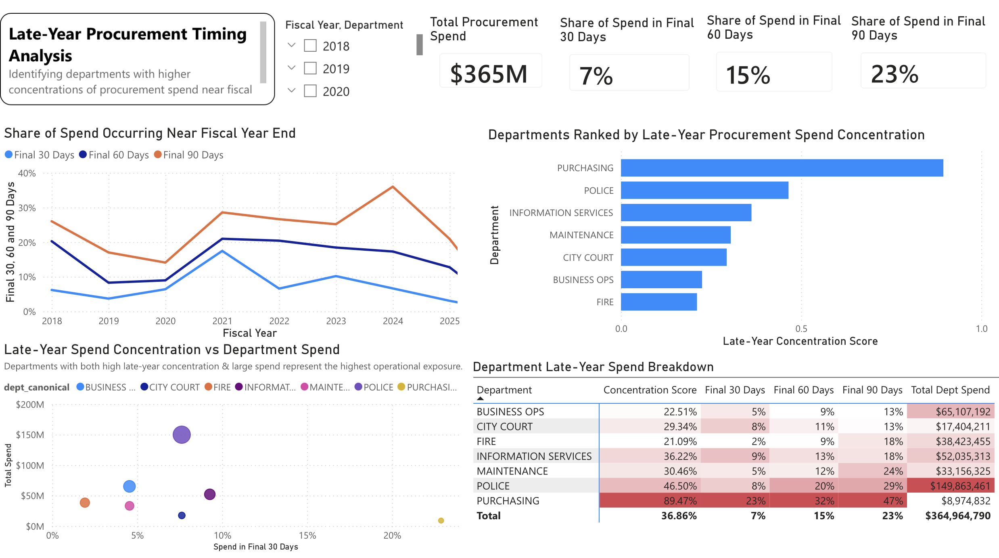
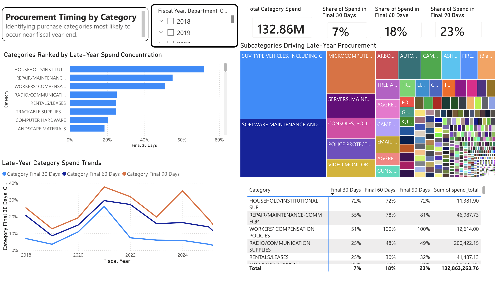
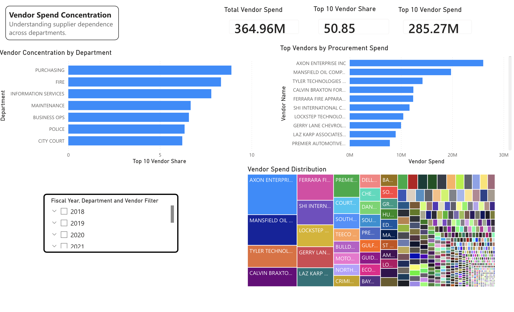
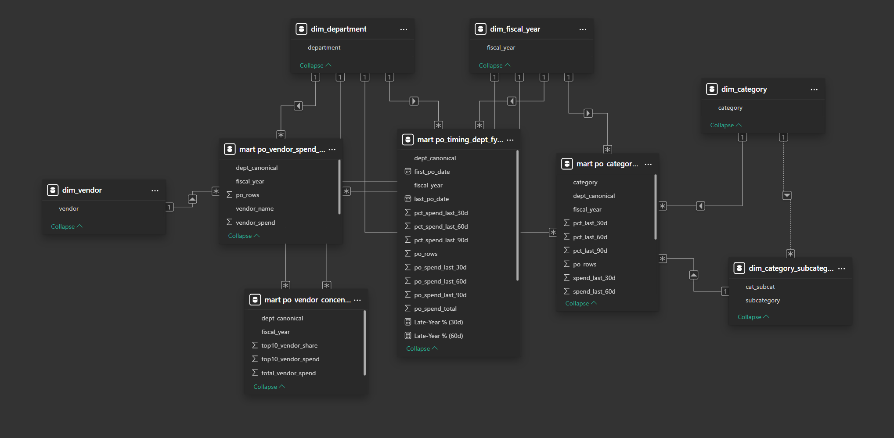

# 📊 Procurement Timing & Vendor Dependence Analysis

This project analyzes procurement behavior across **timing, category, and vendor dimensions** to identify structural spending patterns that are not visible through total spend alone.

The goal is to surface:
- late-year spending concentration
- category-driven purchasing behavior
- supplier dependency risk

---

## 🎯 Business Problem

Organizations often evaluate procurement performance based on total spend, but this approach hides critical behavioral patterns.

This project answers:

- How much procurement spend occurs near fiscal year-end?
- Which departments exhibit high late-year concentration?
- Which categories drive year-end purchasing behavior?
- How dependent are departments on a small group of vendors?

---

## 🧱 Approach

This project follows an end-to-end analytics workflow:

### 1. Data Modeling (PostgreSQL)

- Built SQL-based mart tables as the **single source of truth**
- Applied consistent fiscal year filtering and department mapping
- Designed aggregation logic for timing and vendor concentration

### 2. Semantic Layer (Power BI)

- Implemented a **star schema model**
- Created **weighted measures** to ensure accurate aggregation
- Avoided recalculating business logic in DAX

### 3. Visualization

- Built interactive dashboards to analyze:
  - procurement timing trends
  - category-level sensitivity
  - vendor concentration

---

## 📈 Key Insights

- ~23% of procurement spend occurs in the **final 90 days** of the fiscal year  
- Certain departments show both **high spend and high late-year concentration**  
- Specific categories consistently drive **year-end purchasing spikes**  
- Vendor spend is highly concentrated among a **small subset of suppliers**  

These patterns highlight potential inefficiencies in planning, budgeting, and supplier strategy.

---

## 🧠 Why This Matters

This analysis helps organizations:

- identify late-year spending risk  
- improve procurement planning and budget allocation  
- reduce dependency on a small number of vendors  
- better understand category-level purchasing behavior  

---

## 🖥️ Dashboard Preview

### Late-Year Procurement Timing

### Category Timing Sensitivity

### Vendor Spend Concentration

---

## 🧩 Data Model

- SQL marts used as the analytical foundation  
- Dimension tables created for slicing and filtering  
- No fact-to-fact relationships  
- Single-direction filtering enforced  

---

## 🧾 SQL Logic

Core transformations were implemented in PostgreSQL:

- `mart_po_timing.sql` → Department-level timing metrics  
- `mart_category_timing.sql` → Category timing sensitivity  
- `mart_vendor_concentration.sql` → Vendor concentration and dependency  

These marts serve as the foundation for all Power BI visuals.

---

## 🛠️ Tools Used

- PostgreSQL  
- SQL  
- Power BI  
- DAX  

---

## 🚀 How to Use

1. Clone the repository  
2. Review SQL logic in `/sql`  
3. Open Power BI file (if included)  
4. Explore dashboards and insights  

---

## 📌 Project Takeaway

This project demonstrates the ability to:

- translate business questions into analytical models  
- design scalable SQL-based data marts  
- build clean semantic models in Power BI  
- communicate insights through structured dashboards  
